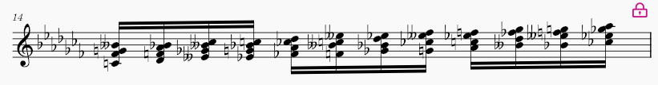
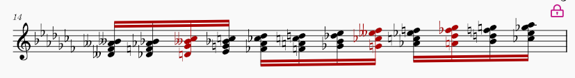
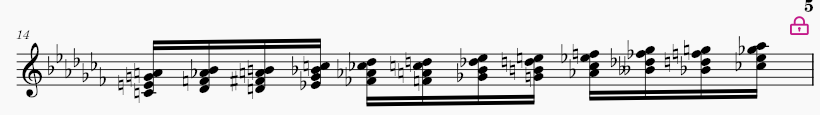

## Chord Pitch Respell plugin for Musescore

Enharmonic respelling tool optimized for MIDI-entered chords, preserving chord quality and respecting the current key signature. Best results are achieved when applied to a range selection, allowing chord-level logic to be applied. Note that the plugin only analyse the chord itself, without the use of a time window; therefore, its logic could be applied to MuseScore core MIDI entry, and this plugin is a proof of concept of a better behavior.

### Parallel maj7 chords
#### Raw MIDI entry

#### MuseScore default pitch respell
Chords in red don't respect the chord quality.

#### This plugin
Every chord is correctly written, and time signature also taken into account.

