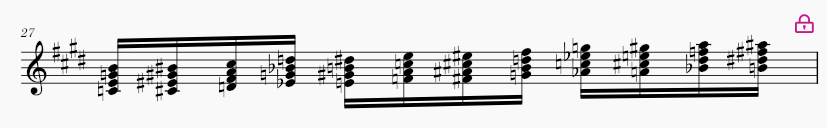
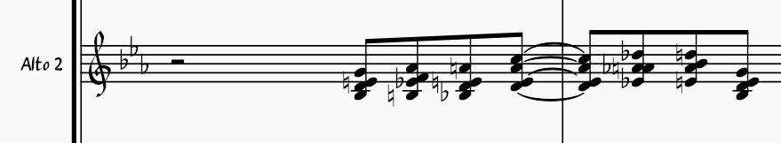
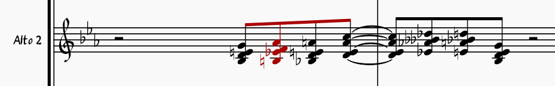
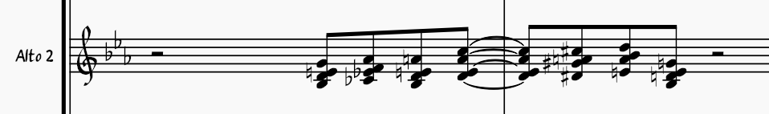
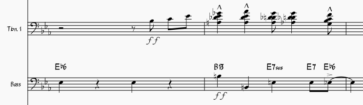
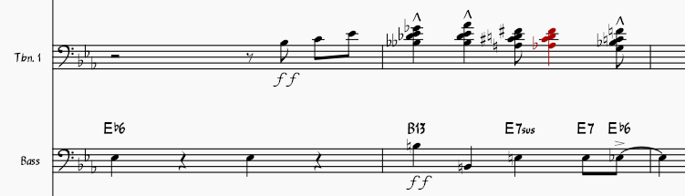
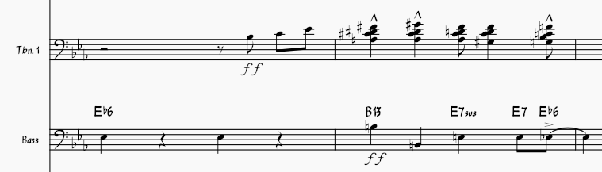

## Chord Pitch Respell Plugin for MuseScore

Enharmonic respelling tool optimized for MIDI-entered chords, preserving chord quality and respecting the current key signature. Best results are achieved when applied to a range selection, allowing chord-level logic to be applied.

Note that the plugin analyzes each chord independently, without using a time window. **As such, its logic could be applied directly to MuseScore’s core MIDI input. This plugin is intended as a proof of concept demonstrating improved enharmonic spelling behavior.**

### Parallel maj7 chords

#### Raw MIDI entry

#### MuseScore default pitch respell
Chords highlighted in red exhibit inconsistent chord quality, even worse than the raw MIDI entry.

#### This plugin
All chords are correctly spelled, with the key signature properly taken into account and improved readability.

### Big band saxophone chords (to be exploded across parts)

#### Raw MIDI entry

#### MuseScore default pitch respell
Chord highlighted in red exhibits inconsistent chord quality, and some double flats could have been avoided.

#### This plugin
All chords are correctly spelled, with the key signature properly taken into account and improved readability.

### Big band trombone chords (to be exploded across parts)

#### Raw MIDI entry

#### MuseScore default pitch respell
Chord highlighted in red exhibits inconsistent chord quality (A♭ and F♯), and some double flats could have been avoided.

#### This plugin
All chords are correctly spelled, with the key signature properly taken into account and improved readability.

